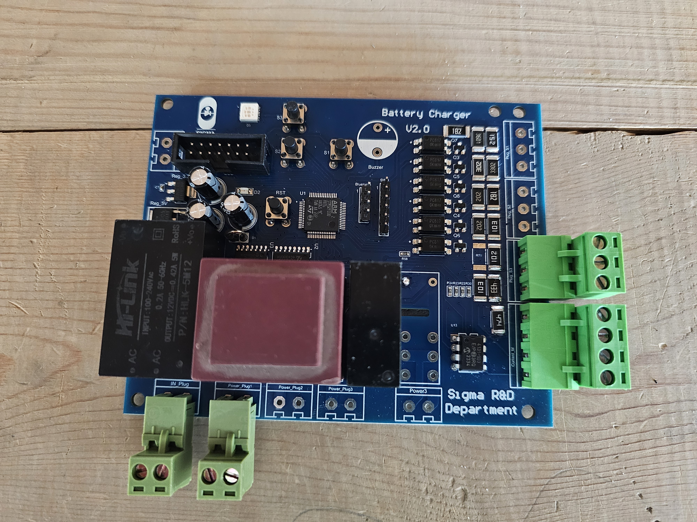

# Mini-Battery-Charger-Family
Commercially deployed digitally controlled lead-acid battery charger family based on STM32F030R8T6.

## Overview

This project presents the development of a low-cost digitally controlled lead-acid battery charger platform designed for industrial and commercial applications.

The charger platform has been adapted into multiple commercially deployed products with different voltage and current ratings.

---

## Key Features

- Low-cost architecture
- Digital voltage regulation
- Three-stage charging algorithm
- STM32-based control
- Closed-loop voltage control
- Configurable charging profiles
- Commercially deployed product

---

## Available Versions

| Model | Rating |
|--------|---------|
| Version 1 | 12V / 20A |
| Version 2 | 24V / 60A |
| Version 3 | 48V / 10A |
| Version 4 | 12V/24V - 90A |

---

## Control Hardware

---

## Design Highlights

- Reverse engineered and redesigned power supply feedback circuitry to support battery charging operation.
- Implemented digital output voltage control.
- Developed analog measurement and signal-conditioning circuits.
- Implemented closed-loop voltage regulation.
- Designed complete hardware and firmware platform.

---

## Firmware Features

- ADC acquisition
- UART communication
- State machine implementation
- Closed-loop control
- Protection functions

---

## Commercial Deployment

This charger platform has been successfully deployed in commercial products currently operating in the field.

Some proprietary design files and source code have been omitted.

---

## Technologies Used

- STM32F030R8T6
- Embedded C
- Altium Designer
- SPI
- UART
- Analog Circuit Design
- Battery Charging Algorithms
